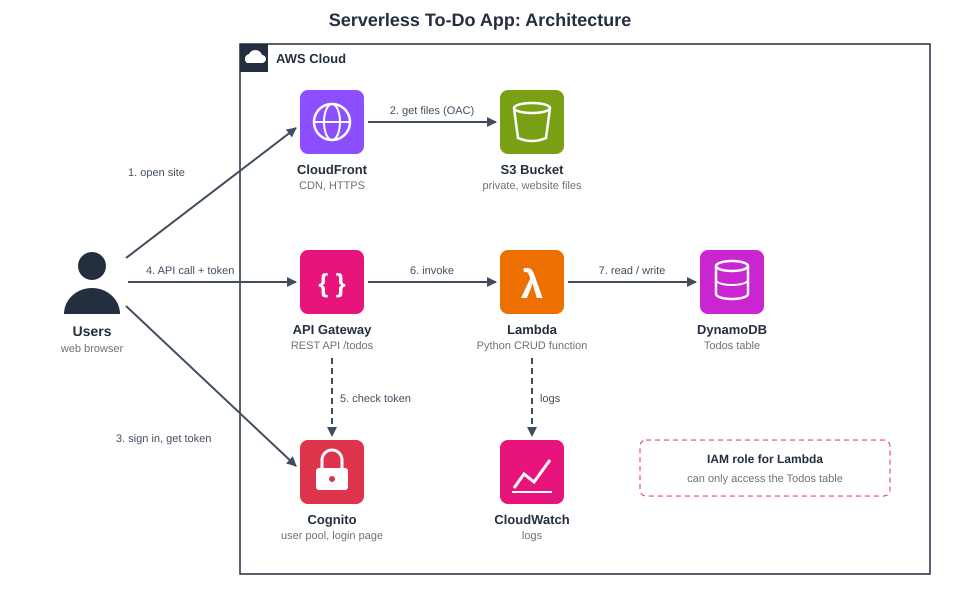

# Serverless To-Do API on AWS
# https://d1ug2ctjcyym6g.cloudfront.net/
My graduation project for the AWS Solutions Architect Associate track at Manara (Project 3).

It's a simple to-do app where you sign up, log in and manage your own tasks. There are no servers. The backend is API Gateway + Lambda + DynamoDB, login is handled by Cognito, and the frontend is a static page on S3 served through CloudFront. 

## Architecture



1. The user opens the site through CloudFront, which reads the files from a private S3 bucket.
2. The user signs in on the Cognito hosted login page and gets back an ID token.
3. The page calls the API with that token in the `Authorization` header.
4. API Gateway checks the token with a Cognito authorizer. Requests without a valid token get a 401 and never reach Lambda.
5. Lambda reads and writes the user's items in DynamoDB.

## Services used

- **API Gateway (REST API):** `/todos` and `/todos/{id}` endpoints, Cognito authorizer, throttling
- **Lambda (Python 3.12):** one function that handles GET, POST, PUT and DELETE
- **DynamoDB:** `Todos` table with `userId` as the partition key and `todoId` as the sort key, on-demand capacity
- **Cognito:** user pool with email sign-up and the hosted login page
- **S3 + CloudFront:** hosts the frontend over HTTPS; the bucket isn't public (Origin Access Control)
- **IAM:** the Lambda role only has access to the one table
- **CloudWatch Logs:** Lambda logs
- **CloudFormation:** creates and deletes everything in one go

## Some decisions I made

- **Serverless instead of EC2:** nothing to manage, and it costs almost nothing when nobody is using it.
- **`userId` as the partition key:** listing a user's tasks is a single query, and one user can never read another user's items. Lambda takes the user ID from the verified token, not from the request.
- **REST API instead of HTTP API:** a bit more setup, but it supports WAF and caching, which I want to add later.
- **Guest mode:** people can try the app without an account. Guest tasks are only saved in the browser (localStorage) and never reach the API, so the API still requires login.
- **Private S3 bucket behind CloudFront:** Cognito needs an HTTPS redirect URL, and S3 website hosting only gives HTTP.

## Project files

```
infrastructure/template.yaml   CloudFormation template (the Lambda code is inline in it)
frontend/index.html            the web page
frontend/config.js             API URL and Cognito settings, filled in after deploying
docs/                          architecture diagram
```

## How to deploy

1. In the CloudFormation console, create a stack and upload `infrastructure/template.yaml`. Give `AuthDomainPrefix` a unique lowercase name (e.g. `todo-yourname-2026`) and tick the IAM acknowledgement. It takes about 5–8 minutes.
2. From the stack's **Outputs** tab, copy `ConfigJs` into `frontend/config.js`.
3. Upload `index.html` and `config.js` to the bucket shown in `WebsiteBucketName`.
4. Open `WebsiteUrl`, sign up, confirm your email and start adding tasks.

To remove everything: empty the S3 bucket, then delete the stack.

## Testing

- Calling the API without a token returns 401.
- Adding, completing and deleting tasks shows up in the DynamoDB table.
- A second user can't see the first user's tasks.
- Opening the S3 file URL directly gives Access Denied.

## Cost

Everything is billed per request, so for a demo it costs close to $0.

